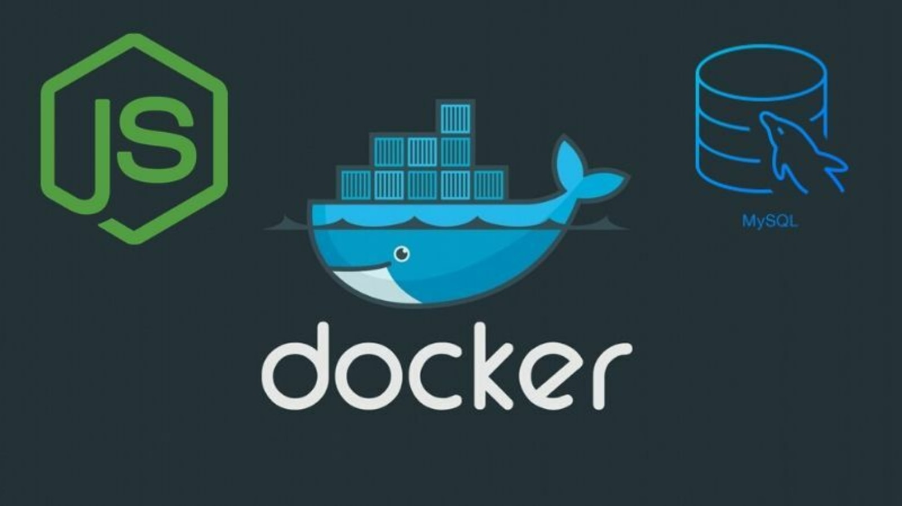

# Docker

### Start

1. fill file .env
2. `docker-compose build` 
3. `docker-compose up` 
4. access http://localhost:3000

### Remove (in order to restart the process)

1. `docker-compose down --remove-orphans --rmi all -v` (down compose and remove all containers, images and volumes associated)
2. `docker network prune` (remove all unused networks)
3. Remove db directory
4. maybe user `docker system prune -a` to clear all docker

### Access mysql

1. `docker ps` (get the id of mysql database)
2. `docker exec -it database-container bash` (enter on mysql container using bash terminal)
3. `mysql -u ${USER} -p${PASSWORD}` (access mysql)

#### Another commands use `docker --help`
